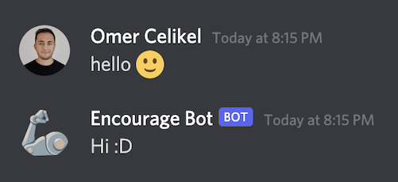
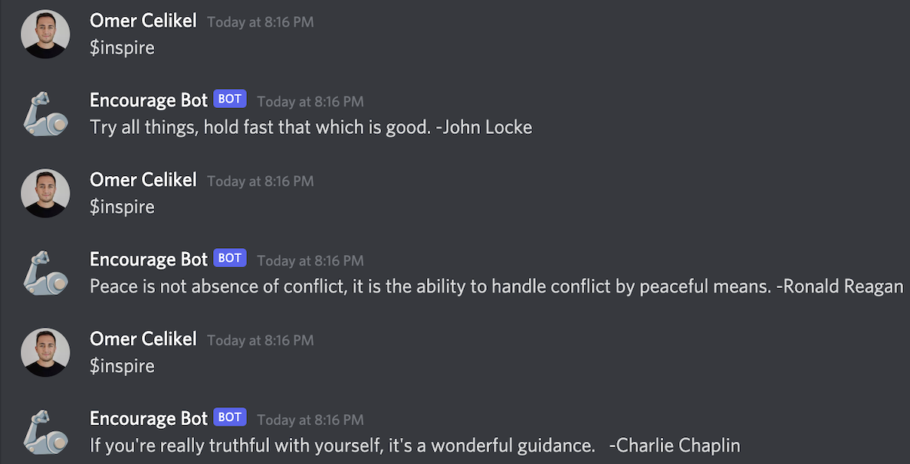
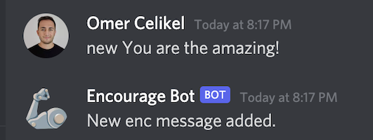

# encourage-bot-discord
 This bot will be there for you when you're sad and need inspiration.

## Notes
- The bot will greet you when you starts with "hi", "hello".
- If you are sad, depressed, he will say words to cheer you up.
- You can add to these words as "new your sentence".
- You can see words of encouragement by typing "inspire".

### Discord Look

## Preview

Actions                                                                    | Screenshots
---                                                                        |---
[Action 1] - *bot greets*                                                  |  
[Action 2] - *bot encourages*                                              | 
[Action 3] - *bot inspires*                                                | 
[Action 4] - *add new ecvoureages sentence*                                | 
[Action 5] - *see the changes*                                             | 

### Created on Replit
Replit is a simple yet powerful online IDE, Editor, Compiler, Interpreter, and REPL. Code, compile, run, and host in 50+ programming languages.
https://replit.com/~

### Bot Lives 7/24
With [uptimerrobot] you can get 50 monitors with 5-minute checks totally FREE. (https://uptimerobot.com/)
https://uptimerobot.com/

